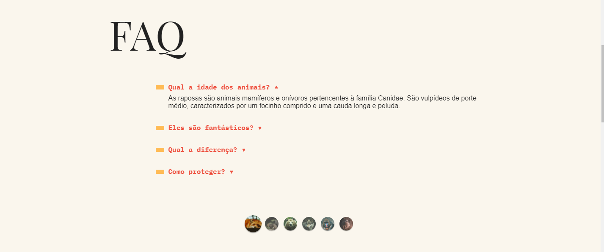
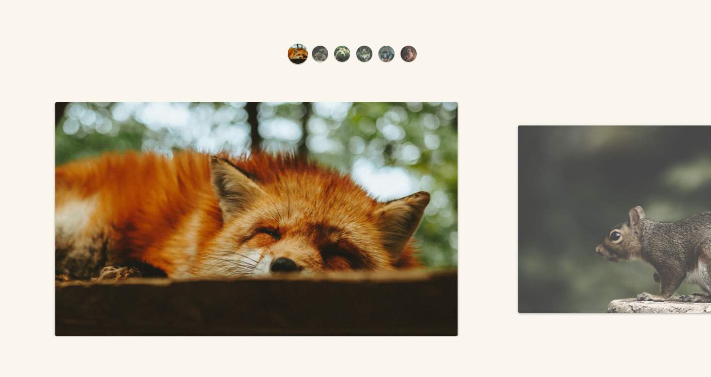
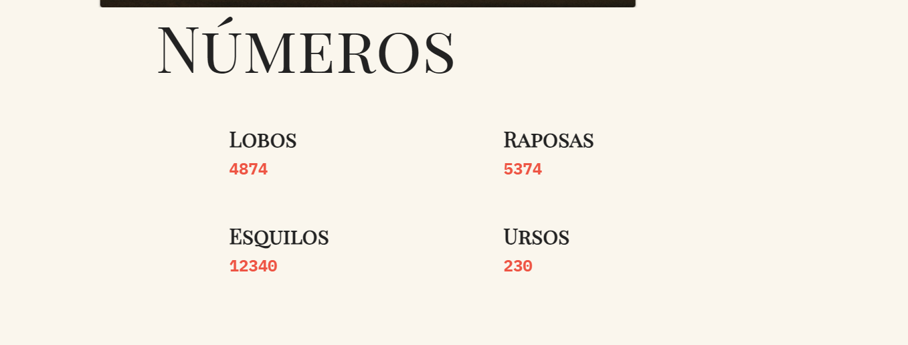
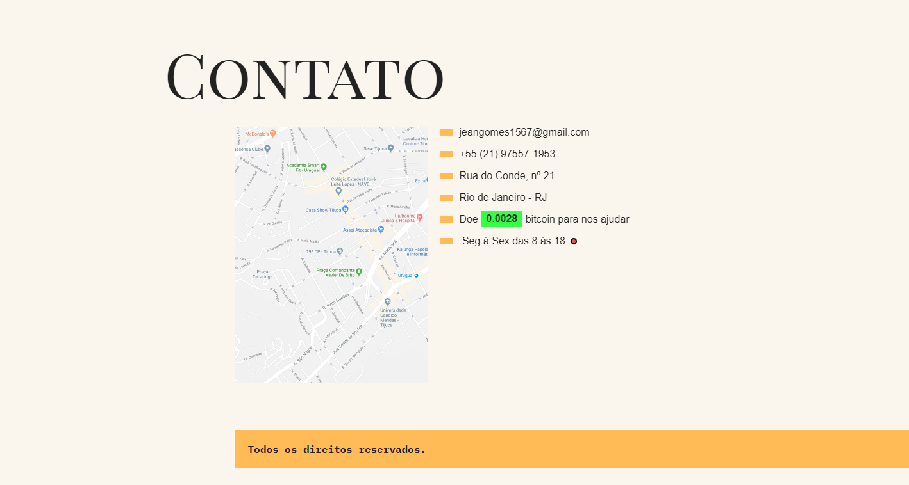

<h1 align="center">Projeto - HTML/CSS/Javascript : Animais fantástico</h1>

<p align="center">
  

  

  
  
  <a href="https://github.com/JeanGomes01/Github-Blog/commits/master">
    
  </a>
    
   <a href="https://github.com/JeanGomes01/animais-fantasticos/stargazers">
    
  </a>
</p>

<p align="center">Vamos construir um Website dinâmico desenvolvido em JavaScript, com design responsivo e interativo. Inclui animações suaves, navegação intuitiva e carregamento assíncrono de conteúdo, proporcionando uma experiência de usuário envolvente e eficiente. </p>

<p align="center">

</p>

## 🥶 Sobre o projeto

Desenvolvi esse projeto para reforçar meus conhecimentos em Javascript do zero ao avançado, com o principal local de aplicação na web, através de manipulações do DOM e requisições via Fetch API.

## 🚀 Tecnologias

Principais tecnologias que utilizei para desenvolver esta aplicação

- [HTML](https://www.w3schools.com/html/)
- [CSS](https://www.w3schools.com/css/)
- [Javascript](https://www.w3schools.com/js/)

## Guia de inicialização

Para instalar e configurar uma cópia local, siga estas etapas simples:

### Pré-requisitos

Para garantir o funcionamento adequado da nossa aplicação, verifique abaixo:

1. **Clone o repositório de terceiros que contém a api pronta para poder testar o app**: Neste link: [Animais-fantasticos](https://github.com/JeanGomes01/animais-fantasticos)

2. **Clone o repositório**:

```sh
git clone https://github.com/JeanGomes01/animais-fantasticos
```

3. **Navegue na raiz do projeto animais-fantasticos:**

4. **Instale os módulos:**

```sh
npm i
```

5. **Rode o projeto:**

```sh
pode ser clique e abra o arquivo index.html no seu navegador.
```

## Roadmap

- [x] Iniciar a aplicação Web.

- [x] Conseguir criar Submenu.

- [x] Conseguir abrir um modal de login.

- [x] Scroll suave ao click.

- [x] Navegação por tabs, com animações diferentes dependendo do click.

- [x] Contagem de números através de arquivos externo

- [x] Tooltip aparecendo ao mover o cursor do mouse na imagem.

- [x] Carregamento valores em tempo real de bitcoin através de uma API.

<!-- --------------------- -->

## UI UX

UI e UX feita pelo time de design do treinamento do curso.

|               Tela inicial                |               Tela FAQ               |
| :---------------------------------------: | :----------------------------------: |
|  |  |

|                    Tela Slide                     |             Tela de números             |
| :-----------------------------------------------: | :-------------------------------------: |
|  |  |

|                Tela Contato                 |     |
| :-----------------------------------------: | :-: |
|  |
